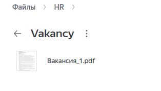
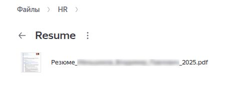
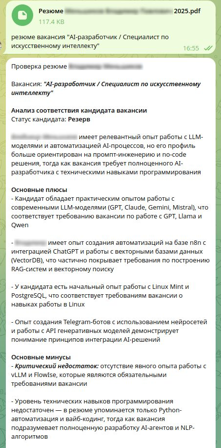
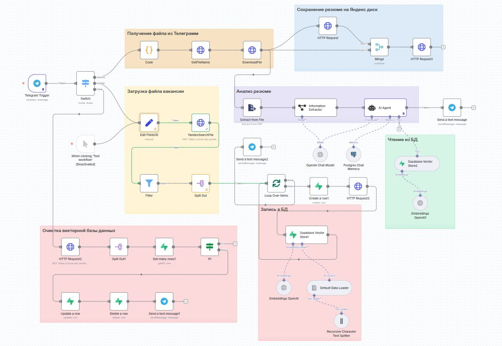

# AI HR-ассистент: Автоматический анализ резюме и подбор кандидатов за 5 минут

**Сократите время подбора с дней до минут — без потери качества и с минимумом ручной работы.**

> 💡 *Этот проект автоматизирует ключевые этапы рекрутинга: загрузку вакансий, анализ резюме и принятие решений — всё через Telegram и Яндекс.Диск.*

---

## 📸 Скриншоты

Ниже представлены ключевые элементы рабочего процесса:

### 1. **Вакансия на Яндекс.Диске**  
  
Файл с описанием вакансии (в формате PDF) хранится в каталоге `Vakancy` на Яндекс.Диске. Удаление файла из этого каталога означает закрытие вакансии.

---

### 2. **Сохранённые резюме на Яндекс.Диске**  
  
После анализа резюме автоматически сохраняются в каталог Resume:  

---

### 3. **Анализ кандидата в Telegram**  
  
HR-специалист отправляет резюме и указывает вакансию — бот мгновенно возвращает структурированный отчёт: соответствие навыкам, рекомендации и уровень релевантности.

---

### 4. **Общий workflow проекта**  
  
Схема автоматизированного процесса:  
1. Загрузка/удаление вакансий на Яндекс.Диск →  
2. Синхронизация с векторной базой данных через команды `обновить_бд` и `очистить_бд` →  
3. Анализ резюме через Telegram →  
4. Сохранение результатов и файлов.

---

**Автоматизируйте найм. Сосредоточьтесь на людях — не на рутине.**
